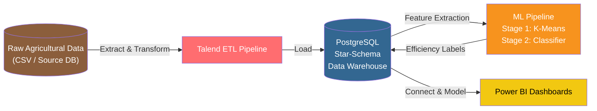
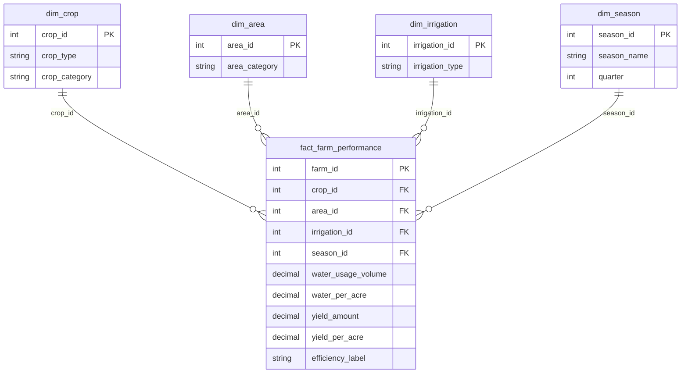

# Qatra: Decision Support System for Smart Agriculture

Business Intelligence and Machine Learning system that classifies farms as water-Efficient or Inefficient to recommend optimal irrigation strategies. The system combines a Talend ETL pipeline, a PostgreSQL star-schema data warehouse, a two-stage ML pipeline, and Power BI analytics dashboards.

<p>
  
  
  
  
  
</p>

---

## Project Documentation

📄 **[View Full Project Report (PDF)](report%20PI.pdf)**  
📊 **[View Presentation Slides (PDF)](docs/presentation.pdf)**

---

## Problem Statement

Small-scale farmers in Tunisia frequently rely on manual or fixed-timer irrigation schedules. This operational approach results in:

* Excess water consumption and higher utility costs
* Soil degradation caused by over-watering or under-watering
* Reduced crop yields due to improper irrigation timing and volume

Existing tools lack localized data insights to guide farmers on precise irrigation timing, volume, and methods.

---

## Solution Overview

Qatra processes historical agricultural records across 5,000 farms to automate irrigation decision-making. The platform executes an end-to-end data workflow:

1. **Ingestion & ETL:** Cleans and structures raw farm records into a star-schema data warehouse.
2. **Two-Stage Machine Learning:** Groups unlabeled farms using unsupervised clustering, then trains a supervised classifier to predict efficiency for new records.
3. **Analytics & Dashboards:** Surfaces water usage trends, crop performance, and efficiency ratings through interactive Power BI views.

---

## Technical Architecture



| Pipeline Layer | Technology | Primary Function |
|---|---|---|
| Ingestion | Talend Open Studio | Extracts, cleans, and transforms raw farm data |
| Data Warehouse | PostgreSQL | Central star-schema database storing facts and dimensions |
| ML Engine | Python (scikit-learn) | Runs clustering to generate labels and trains the classification model |
| Visualization | Power BI Desktop | Displays operational KPIs, yield metrics, and water usage analytics |

---

## ETL Pipeline

Talend Open Studio handles the data preparation and transformation layer:

* **Data Cleaning:** Resolves missing entries, standardizes area units (hectares vs. acres), and normalizes categorical text fields.
* **Feature Engineering:** Derives `area_category` (Small, Medium, Large) and `crop_category` (Cereal, Vegetable, Legume, Fiber, Cash Crop) based on physical farm parameters.
* **Database Loading:** Populates dimension tables (`dim_crop`, `dim_area`, `dim_irrigation`, `dim_season`) and writes foreign key constraints to `fact_farm_performance`.

---

## Data Warehouse Schema

The data warehouse uses a star schema centered around farm operational performance:



---

## Machine Learning Pipeline

Raw agricultural records lack pre-existing efficiency tags. The system uses a two-stage pipeline to establish baseline criteria and classify future inputs.

### Stage 1: Unsupervised K-Means Clustering

K-Means groups the 5,000 dataset records according to normalized metrics (water volume per acre, yield output, irrigation system type).

```python
from sklearn.cluster import KMeans
from sklearn.preprocessing import StandardScaler

X_scaled = StandardScaler().fit_transform(X)
kmeans = KMeans(n_clusters=2, random_state=42)
clusters = kmeans.fit_predict(X_scaled)
```

The output clusters are analyzed against yield ratio thresholds to assign target labels: **Efficient** or **Inefficient**.

### Stage 2: Supervised Classification

A supervised model is trained on the cluster-derived labels to classify incoming farm records without requiring full dataset re-clustering.

| Evaluation Metric | Score |
|---|---|
| Model Algorithm | Random Forest Classifier |
| Accuracy | 94.2% |
| Precision | 0.93 |
| Recall | 0.95 |
| F1-Score | 0.94 |

---

## Power BI Dashboards

The analytical model contains two main report screens filterable by fiscal quarter:

**Water Consumption Analysis**
* Top-level KPIs: Total water usage volume and average water usage per acre
* Breakdown by crop type and general crop category (Cereal, Vegetable, Legume, Fiber, Cash Crop)
* Distribution by land size (Small, Medium, Large)
* Volume breakdown across irrigation methods (Drip, Rain-fed, Manual, Sprinkler, Flood)
* Seasonal consumption trends (Kharif, Zaid, Rabi)

**Yield & Productivity Analysis**
* Top-level KPIs: Total crop yield and yield per acre
* Yield performance by farm size category and crop type
* Historical yield trend analysis across monthly cycles
* Efficiency comparisons across irrigation methods

---

## Installation & Setup

### 1. Clone Repository

```bash
git clone [https://github.com/RaedMeddeb/qatra-irrigation-dss.git](https://github.com/RaedMeddeb/qatra-irrigation-dss.git)
cd qatra-irrigation-dss
```

### 2. Configure PostgreSQL Database

```bash
psql -U postgres -f database/source_schema.sql
psql -U postgres -f database/dw_schema.sql
```

### 3. Execute Talend ETL Jobs

Open the jobs located in `etl/` inside Talend Open Studio and execute them sequentially to load dimension and fact tables.

### 4. Set Up Python Environment

```bash
python -m venv venv
source venv/bin/activate   # On Windows: venv\Scripts\activate
pip install -r requirements.txt
```

### 5. Run ML Pipeline

```bash
python ml/train_clustering.py   # Stage 1: K-Means labeling
python ml/train_classifier.py   # Stage 2: Supervised model training
```

### 6. View Dashboards

Open `dashboards/Qatra_Dashboard.pbix` in Power BI Desktop and update the connection string under **Transform Data -> Data Source Settings** to point to your PostgreSQL instance.

---

## requirements.txt

```txt
pandas>=2.0
numpy>=1.24
scikit-learn>=1.3
matplotlib>=3.7
seaborn>=0.12
```

---

## Repository Structure

```text
qatra-irrigation-dss/
├── report PI.pdf                 # Main technical project report
├── README.md                     # Repository documentation
├── data/
│   └── farm_records.csv          # 5,000 raw farm records
├── database/
│   ├── source_schema.sql         # Source database DDL
│   └── dw_schema.sql             # Star schema DDL
├── etl/
│   ├── Load_DIM_CROP.item
│   ├── Load_DIM_AREA.item
│   ├── Load_DIM_IRRIGATION.item
│   ├── Load_DIM_SEASON.item
│   └── Load_FACT_FARM_PERFORMANCE.item
├── ml/
│   ├── train_clustering.py       # Stage 1 script
│   ├── train_classifier.py       # Stage 2 script
│   ├── evaluate.py               # Performance metrics script
│   └── model.pkl                 # Serialized model artifact
├── dashboards/
│   └── Qatra_Dashboard.pbix      # Power BI dashboard file
└── docs/
    └── presentation.pdf          # Project presentation slides
```

---

## Contributors

Academic project created for the Business Intelligence & Machine Learning course.

* **Azza Jouini:** Project Architect and Team Leader
* **Firas Ben Salem:** ETL Development and Data Modeling
* **Hanna Hmouda:** Database Design and SQL Implementation
* **Raed Meddeb:** ML Pipeline Evaluation, Classification Benchmarking, and Power BI Dashboard Design
* **Salsabil Ben Elhadj:** Data Preprocessing and Feature Engineering
